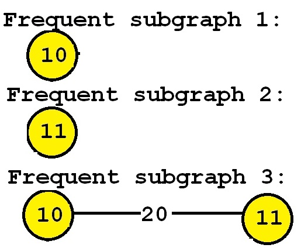
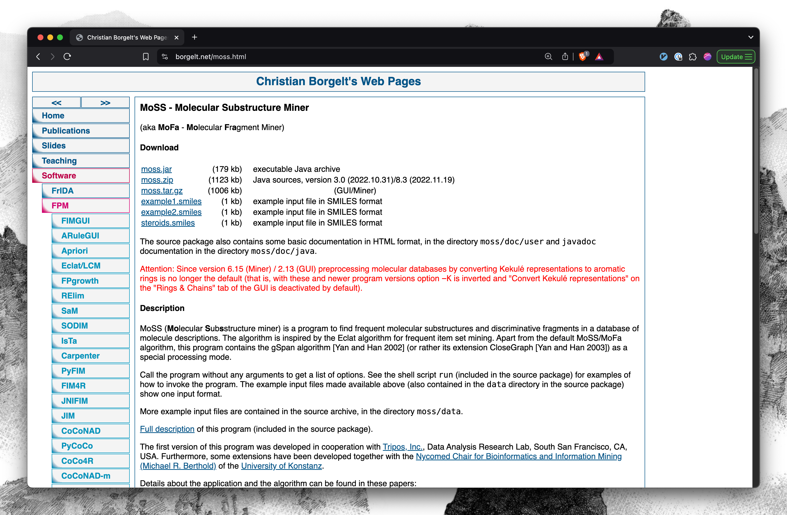

# Klasyfikacja molekuł za pomocą FSM

---
## Co to jest FSM?

Jest to technika polegająca na znalezieniu w jakiejś bazie grafów często występujących podgrafów

-v-


-v-



---

## MoSS



-v-

#### Przykładowy output

```
id,description,nodes,edges,s_abs,s_rel,c_abs,c_rel
1,S(-O)(-N)-C,4,3,3,50.0,0,0.0
2,S(-O)-C,3,2,4,66.666664,0,0.0
3,S(-N)-C-C,4,3,3,50.0,0,0.0
4,S(-N)-C,3,2,5,83.333336,0,0.0
5,S(-C)=N,3,2,3,50.0,0,0.0
6,S-C,2,1,6,100.0,0,0.0
```

-v-

#### Przykładowy output cz.2

```
1:a,b,c
2:a,b,c,f
3:a,b,d
4:a,b,c,d,e
5:d,e,f
6:a,b,c,d,e,f
```

---

## Kompilacja do kodu binarnego

-v-

#### x86
```
FROM ghcr.io/graalvm/native-image-community:17 as build
COPY ./moss /home/moss/moss

WORKDIR /home/moss

RUN echo "Main-Class: moss.Miner" > manifest
run javac -Xlint moss/*.java
run jar cfm miner.jar manifest moss/*.class

run native-image -jar miner.jar miner_1

from scratch
copy --from=build /home/moss/miner_1 /
entrypoint ["/miner_1"]
```
```
docker build --output=. .
```

-v-

#### Apple Sillicon

```bash
gu install native-image
javac moss/*.java
echo "Main-Class: moss.Miner" > manifest
jar cfm miner.jar manifest moss/*.class
native-image -jar miner.jar miner
```

-v-

``` zsh
➜ file ./miner
./miner: Mach-O 64-bit executable arm64

```

---

## Użycie w pythonie

-v-


---

## Wyniki
| Dataset | Klasyfikator       | Wartość p  | AUC    |
| ------- | ------------       | ---------- | ------ |
| BACE    | RandomForest       |     19     | 53.44% |
| BBBP    | RandomForest       |      3     | 66.20% |
| HIV     | RandomForest       |      8     | 63.48% |
| BACE    | LogisticRegression |     13     | 54.078 |
| BBBP    | LogisticRegression |      3     | 66.92% |
| HIV     | LogisticRegression |      8     | 63.18% |

--- 

Dziękuję za uwagę
