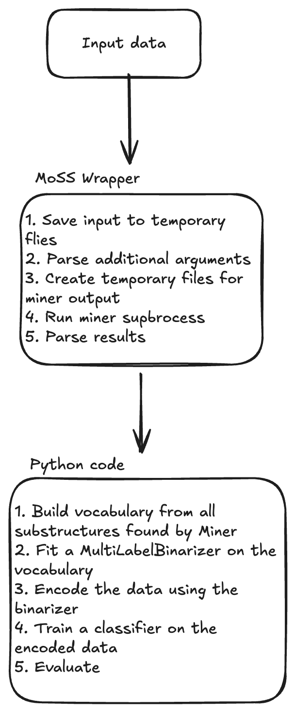

# Frequent subgraph mining w klasyfikacji molekuł
#### Autor: Paweł Zaręba

## 1. Molecular Substructure Miner
Do realizacji projektu wykorzystano narzędzie [MoSS](https://borgelt.net/moss.html) - Molecular Substructure Miner.
Służy on do znajdowania często występujących podstruktur oraz fragmentów dyskryminacyjnych w bazie cząsteczek opisanych za pomocą formatu SMILES.

Jest to program napisany napisany w Javie, który operuje na plikowym I/O, więc użycie go z poziomu języka Python wymagało utworzenia dedykowanego wrappera, który będzie go wykonywał.

Korzystanie z archiwum kodu Javy (pliku `.jar`), niesie ze sobą wadę w postaci wprowadzenia dodatkowej zależności dla użytkownika końcowego - środowiska wykonawczego Javy.

W celu wyeliminowania tego problemu, kod Javy zkompilowano do pliku binarnego, korzystając z rozwiązania [GraalVM Native Image](https://www.graalvm.org/latest/reference-manual/native-image/). Dodatkową zaletą takiego podejścia był zysk w szybkości działania programu - kod natywny jest szybszy od kodu wykonywanego w środowisku JVM.

## 2. Aplikacja MoSS do klasyfikacji molekuł
W celu zaaplikowania programu MoSS do problemu klasyfikacji molekuł posłużyłem się następującym pipeline'm:

## 3. Rezultaty
| Dataset | Klasyfikator       | Wartość p  | AUC    |
| ------- | ------------       | ---------- | ------ |
| BACE    | RandomForest       |     19     | 53.44% |
| BBBP    | RandomForest       |      3     | 66.20% |
| HIV     | RandomForest       |      8     | 63.48% |
| BACE    | LogisticRegression |     13     | 54.078 |
| BBBP    | LogisticRegression |      3     | 66.92% |
| HIV     | LogisticRegression |      8     | 63.18% |

